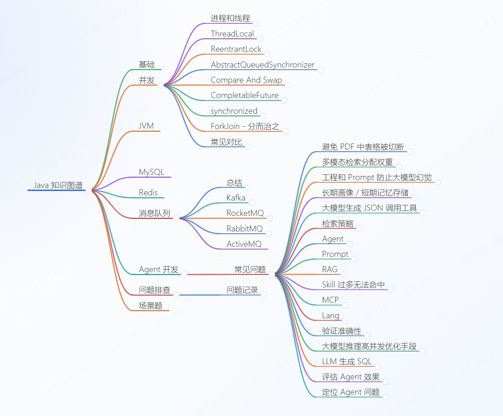

# Java Backend Knowledge Map

一个持续整理 Java 后端知识点、面试八股和工程经验的交互式知识图谱。

## 在线查看

[打开交互式知识图谱](https://illuseahashmap.github.io/java-backend-knowledge-map/)

## 图谱预览

下图是当前知识图谱的静态总览，适合快速确认整体结构和主要分支；查看、缩放和展开节点请使用上面的在线交互版本。

