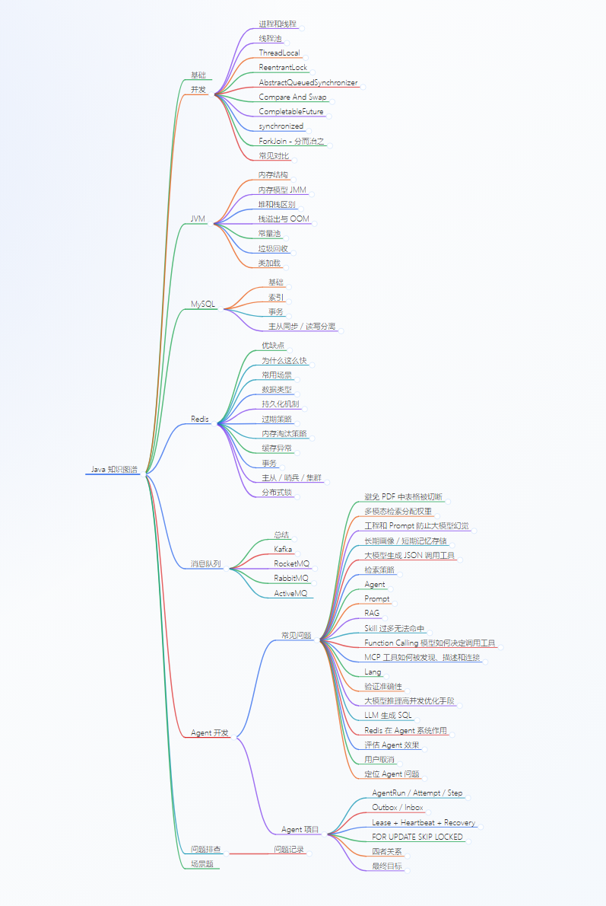

# Java Backend Knowledge Map

一个持续更新的 Java 后端与 Agent 工程个人技术博客，以 Markdown 为源文件，以 Markmap 作为可视化导航。

这里不只记录结论，也记录概念之间的联系、容易混淆的边界、失败案例和逐步形成的理解。

## 在线阅读

[打开交互式知识图谱](https://illuseahashmap.github.io/java-backend-knowledge-map/)

## 内容范围

- Java 并发、JVM、类加载和垃圾回收
- MySQL、索引、事务、MVCC 和主从复制
- Redis 数据结构、持久化、主从、Sentinel 和 Cluster
- Kafka、RocketMQ、RabbitMQ 等消息系统
- RAG、Agent、MCP、Tool Calling 和大模型工程化
- 真实学习过程中的问题、纠正和工程经验

## 如何阅读

思维导图适合快速建立知识结构；Markdown 源文件适合查看完整解释、例子和补充说明。

```text
在线图谱 -> 了解整体结构
展开节点 -> 快速复习
阅读源文件 -> 理解原理和边界
```

## 项目文件

```text
java-backend-knowledge-map.md  # 可编辑的 Markmap 源文件
docs/index.html                # 在线交互式图谱
docs/java-backend-knowledge-map-overview.png  # 静态预览图
```

## 更新方式

知识内容按学习进度持续补充，优先记录已经理解、验证和纠正过的内容。项目会逐步增加源码分析、实验结果、常见追问和可复现示例。


